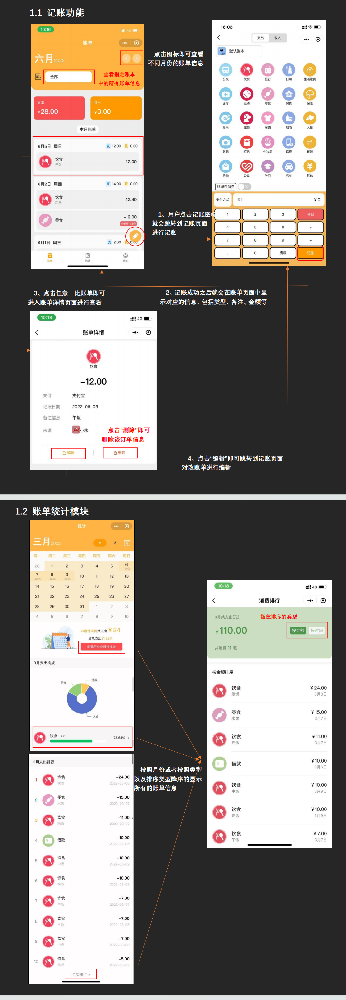
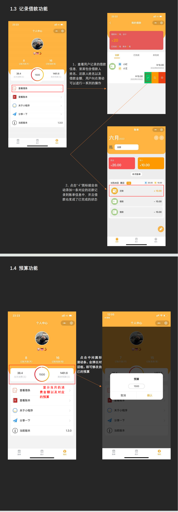
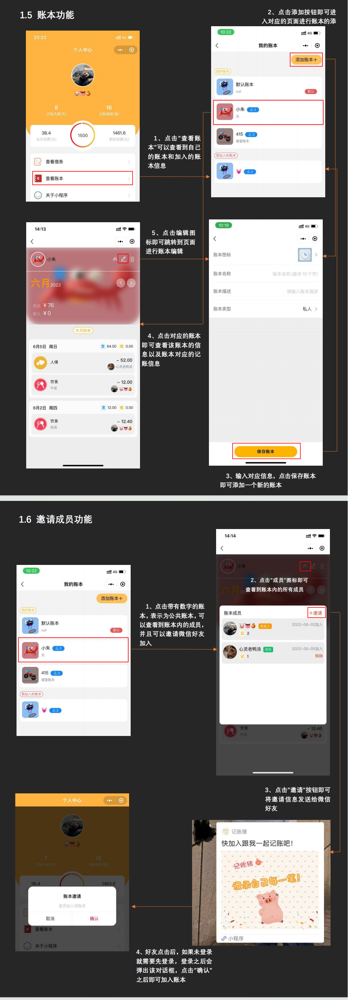
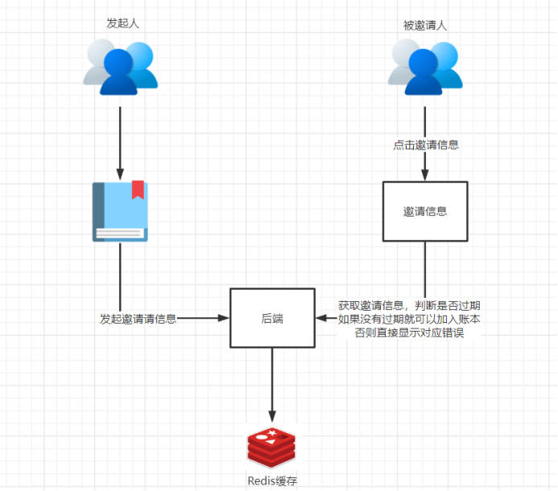
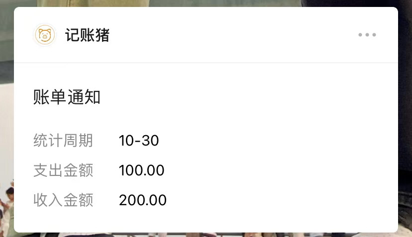

# 记账猪小程序

> 作者：xiaozhu

# 一、项目概览

## 1.1 项目需求

​    作为大学生，我们时刻关注日常开销。记录这些开销有时成为烦恼。部分人因不明确规划破坏存钱目标；部分人因共同开销划分产生分歧；部分人因借还时间久远忘记“债务”。因此，经过思考，我决定开发记账猪小程序。该程序兼顾常规记账信息，支持多人同时记账。目标是让用户清晰了解自己收支及预算情况，通过百分比快速查看各方面开销。小程序中设有借款还款模块，方便用户记录并查看。也可新建账本，分类记录账单信息。

## 1.2 项目介绍

​    本项目是多人记账小程序，包含账单页、统计页、个人中心页、账单详情页、账本页等。

    在账单页面，用户可查看当月每笔账单，按账本分类，简单操作记录每笔支出。
    
    统计页面以表格和圆形图显示当前月份每天收支及类型占比，可按金额排序查看，下方还有金额前十账单排行。
    
    个人中心页显示记账天数和笔数，可设置预算，查看剩余预算和每日可用余额。
    
    账本页面显示个人及加入的账本，可新建账本记录不同账单，邀请微信好友协作记账，但只能修改删除自己记录，移除成员或删除账本将删除全部信息，需谨慎操作。

> 适用人群：全部

## 1.3 技术实现

前端：微信小程序

UI组件：Vant、IView

统计图：ECharts

后端：SpringBoot+Mybatis+Redis+MySQL

## 1.4 解决问题

​    这款小程序适合那些经常会记录自己开销以及收入的人群，不分男女也不分年龄的大小，每个人都能够快速的记录一笔账单，并且每一笔账单都可以记录到不同的账本中，用户可以根据自己的行为习惯来选择对应的账本进行记录

​    还可以进行多人在线记账，比如一对情侣或者是一个寝室，都希望这个开支能够明细一点，让大家都看到，这个时候多人账本就能够完成这一点，通过邀请微信中的好友加入到该账本中，大家都可以往里面记账，也可以看到账本中所有成员的记账信息

​    在实际的生活中，我们也会存在一些借款以及还款，但是有的时候我们会忘记了自己以及别人的借款，时间久了之后，两个人可能都忘记了。在该小程序中，有一个”借款”的记账类型，选择该类型后输入”借方”和”还方”之后就能记录一条借款的账单信息，并且每一笔还款都不需要自己手动添加，只需要点击对应的按钮即可生成还款信息，十分的方便

## 1.5 演示环境

# 二、产品设计

## 2.1 项目功能

## 2.2 项目亮点

### 2.2.1 账本邀请

   项目中最大的亮点还是在当用户点击邀请好友按钮的时候，会随机生成了一个不重复并且唯一的id放入Redis缓存当中，并且这个id是以用户的openId加账本id进行存储，所以也保证了缓存的唯一性，每当用户点击对应别人的邀请时候，会先去Redis当中判断是否存在验证码并且验证码是否过期，然后会给出相应的提示

   为了防止账本加入人数的过溢问题，使用了Redission分布式锁来解决这一问题，使得在高并发的场景下也能够很好的解决账本人数溢出问题

### 2.2.2 定时发送日报和周报

​    每天及每周的早上八点会定时的给用户发送日报或者周报信息，如果用户当天或当周没有记账的话，那么就不会发送；这样可以让用户快速的了解到近段时间的支出与收入状况，能更好的调整以及规划自己的消费

# 三、项目扩展

## 3.1 AI账单分析

​    目前AI十分的火热，通过AIGC技术，根据用户不同时间段不同类别的支出与收入情况，分析用户的账单信息，给出用户对应地消费建议
