# Agent智能记账小程序

> 作者：xiaozhu

Gitee：[https://github.com/tiancheng2002/pig-account](https://gitee.com/i-like-potato-chips/pig-account)

# 项目介绍

一个基于 AI Agent 的对话式自动记账微信小程序。它不再只是简单调用单一 AI 接口完成识别，而是通过 Billing Agent、通用 Tool Agent 和后端业务工具协同工作，让用户可以直接用自然语言或账单图片完成记账、查询和分析。

例如输入“今天中午吃饭花了 30 元”，Billing Agent 会自动理解这是一笔支出，提取金额、时间、类别、备注等关键信息，并在后端完成分类校验和账单入库。如果用户只输入“吃饭”，系统也会主动追问缺失的金额，并通过 Redis 保存草稿，在用户补充后继续完成同一笔账单。上传外卖订单、支付截图或小票图片时，OCR 识别结果也会进入 Agent 记账流程。

除了自动记账，小程序还支持通过对话查询真实账单数据。用户可以问“这个月花了多少”“上个月呢”“再按类别看看”，通用 Tool Agent 会根据意图调用后端工具，查询账单列表、月度收支汇总、类别排行和每日趋势等数据，避免 AI 凭空生成结果。

小程序界面简洁直观，没有复杂繁琐的操作流程，初次使用也能快速上手。同时支持多账本管理，用户可以创建不同账本记录个人或家庭账单，也可以邀请朋友加入账本进行协作记账。

系统还提供日历视图、饼图、趋势图等可视化组件，帮助用户更清晰地了解收入和支出结构。结合 AI 分析与真实统计数据，用户可以更轻松地回顾消费习惯，规划和管理自己的财务。

## 技术栈

前端：微信小程序

UI组件：Vant、IView

统计图：ECharts

后端：SpringBoot、Mybatis、Redis、MySQL、Minio、DeepSeek API、OCR等

## 功能列表

### 基础记账与账本能力

- 支持微信授权一键登录，全程不强制收集手机号，降低使用门槛并保护用户隐私。
- 支持按月查看收入、支出和账单明细，账单会按照日期分组展示，点击后可查看详情、编辑或删除。
- 支持日历视图展示每日收入和支出金额，点击具体日期可查看当天账单详情。
- 支持饼图展示指定月份的收入或支出类别占比，帮助用户快速了解消费结构。
- 支持账单排行功能，可按类别、月份、金额等维度查看收入或支出排行。
- 支持手动记账，用户可选择类别、输入金额、选择账本并快速完成账单记录。
- 支持自定义收入和支出类别，满足不同用户的个性化记账需求。
- 支持预算功能，用户可设置月度预算，更合理地规划支出。
- 支持多账本管理，用户可以创建不同类型的账本，单个用户最多可创建和加入 5 个账本。
- 支持账本协作，用户可以邀请好友加入公开账本，共同记录和管理账单。
- 支持账本成员管理，发起人可移除成员，成员也可自行退出，相关成员在该账本中的账单记录会同步处理。
- 支持自定义上传账本图标和用户头像，让账本和个人信息展示更加个性化。
- 支持生成动态小程序邀请码，方便邀请好友加入账本协作。

### AI Agent 智能记账能力

- **对话式自动记账**：用户只需输入自然语言，例如“今天中午吃饭花了 30 元”，Billing Agent 会自动提取金额、类别、时间、收支类型等关键信息，并完成账单记录。
- **多轮追问补全账单**：当用户输入的信息不完整时，例如只说“吃饭”，Agent 会主动追问缺失字段，并保存临时草稿；用户补充“30 元”后，系统会自动合并上下文并完成入账。
- **OCR 图片识别记账**：支持外卖订单、微信/支付宝账单、纸质小票、截图等图片场景，OCR 识别后的内容会继续进入 Billing Agent 流程完成智能记账。
- **本地 Fallback 容错能力**：当大模型调用异常或响应不稳定时，系统会通过本地规则识别金额、日期、常见类别和支付方式，提升记账链路的稳定性。
- **分类与权限校验**：AI 提取出的类别不会直接写入数据库，后端会校验该类别是否属于当前用户可用类别，并检查收支类型是否匹配，避免错误入账。
- **自然语言账单查询**：用户可以直接询问“这个月花了多少”“上个月呢”“餐饮支出是多少”，Tool Agent 会调用后端工具查询真实账单数据。
- **连续追问理解**：Agent 支持短期对话记忆，可以理解“上个月呢”“再按类别看看”等连续问题，不需要用户重复完整条件。
- **账单统计与趋势分析**：支持通过 Agent 查询月度收支汇总、类别支出排行、每日支出趋势和账单列表。
- **AI 账单分析**：系统可以结合真实账单数据生成消费总结、风险提示和理财建议，帮助用户更好地复盘消费习惯。
- **对话式类别创建**：用户可以通过聊天添加收入或支出类别，例如“添加一个文具支出类别”，Agent 会生成操作预览，并在用户确认后再写入数据。
- **写操作确认机制**：涉及新增类别等写操作时，系统不会直接执行，而是先返回确认提示，用户确认后才会真正写入，降低误操作风险。
- **工具调用安全控制**：Agent 只能调用后端已注册的白名单工具，不能生成 SQL，也不能自行指定用户身份，所有真实数据查询都由后端服务完成。

# Agent工作流程图

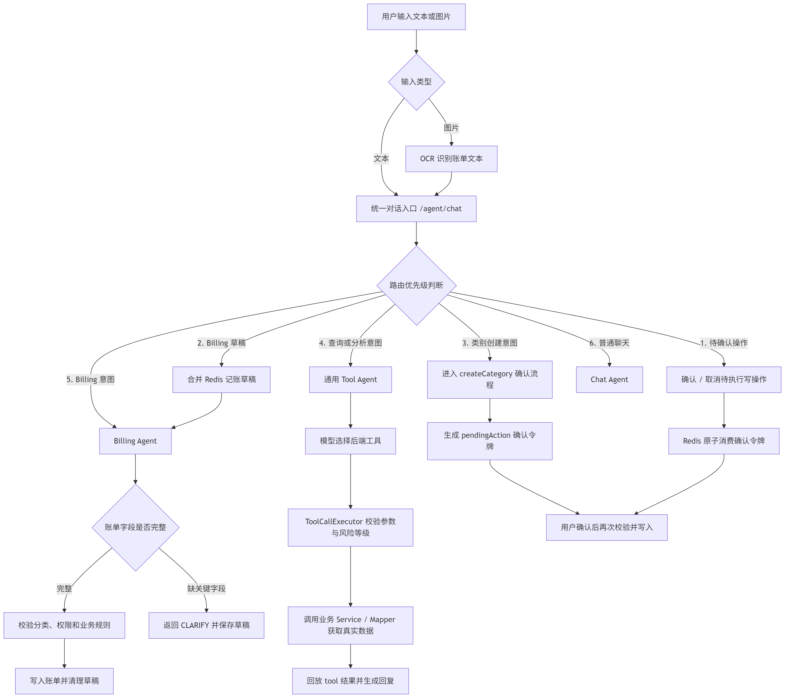

# 功能演示

### 首页

在首页可以查看到某个月的所有支出与收入情况，并且会根据日期对每一天的支出与收入进行划分，在顶部可以点击对应的年月进行切换，右侧还可以查看指定账本中的账单数据

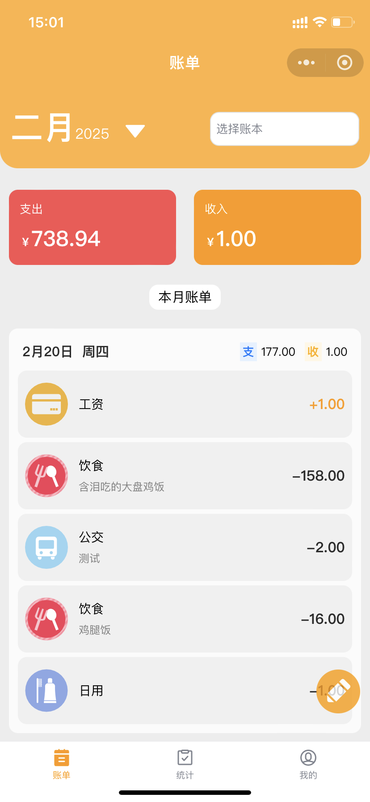

点击对应的账单数据就能查看到对应的详情，也可以对账单进行编辑，也可以将他删除

### 日历表展示

在统计页的最上方会有一个日历表，会显示某个月的每一天的支出或收入金额，并且各自的颜色深度会随着金额的大小而变化，点击对应的日期还能查看到某一天的支出或收入情况

  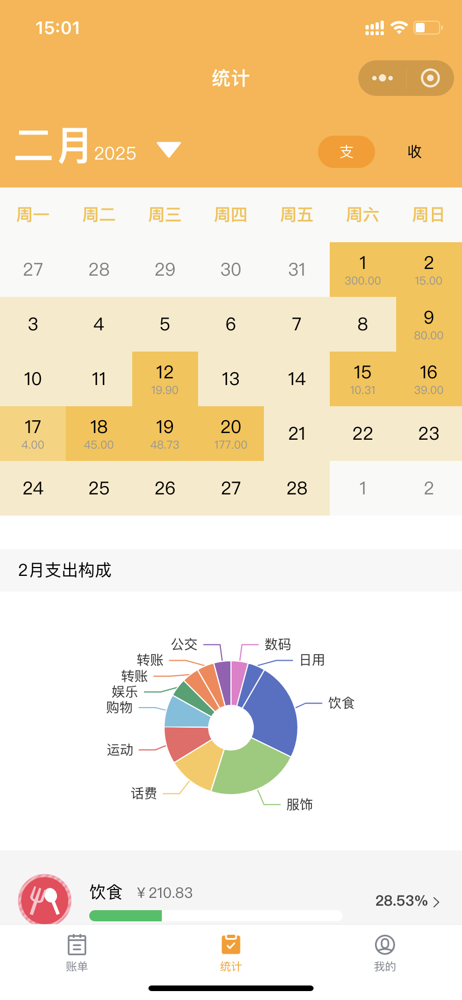

  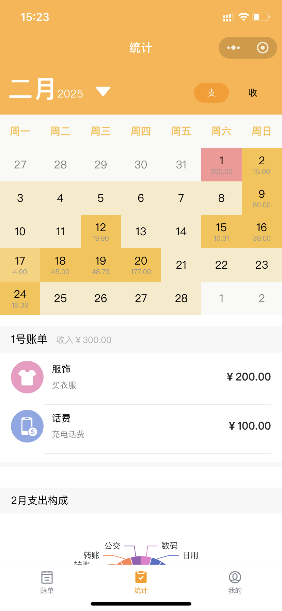

### 统计图展示

在日历表的下方会有一个饼状统计图，主要是展示某个月支出或收入的占比，让用户可以清晰的感知自己在不同类别的消费或收入情况，点击下方对应类别会调转到账单排行页，里面可以查看某一类别的账单数据排行

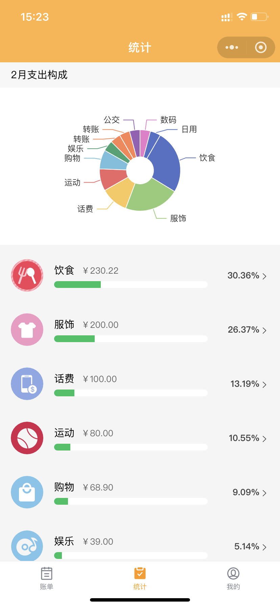

### 账单排行

在饼图的下方会有一栏账单排行的数据列表，会按照金额大小从高到低展示某月支出或收入的账单数据，如果数据超过十条的话，可以点击最下方的`全部排行`跳转到账单排行页进行查看，在里面可以按照金额或时间进行排序

  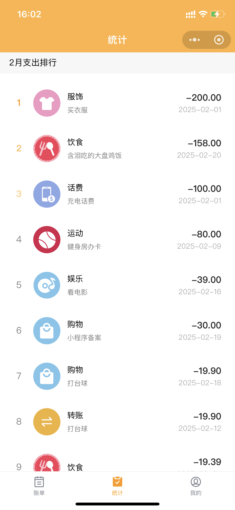

  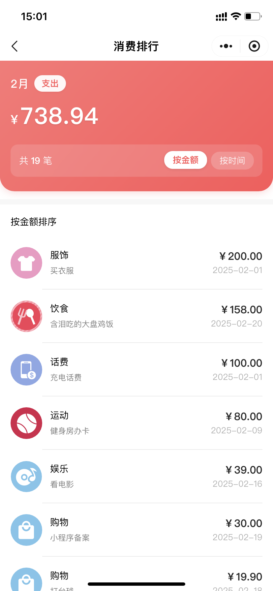

  

### 个人中心

在个人中心页面，用户可以看到自己的记账天数以及记账笔数，还可以看到自己的剩余预算信息。点击头像名称或预算就会跳转到编辑页，在里面可以更改自己的头像、昵称以及预算信息

  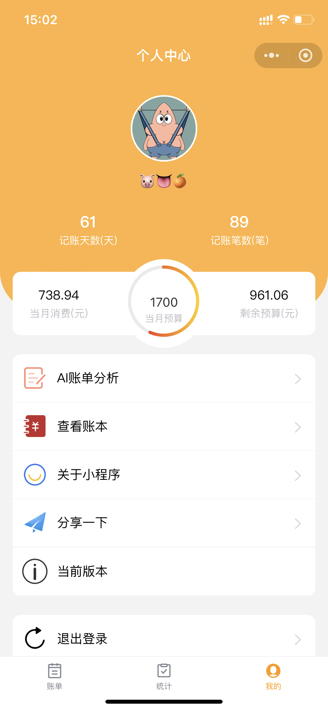
  
  
  
  

### 记账功能

在记账页中，用户可以自主的选择对应的类别、支付方式、要记录的账本以及输入金额和备注等信息，然后点击记账按钮就可以轻松的完成一笔记账啦

  
  
  

### 自定义类别

在自定义类别页，用户可以自定义自己的类别内容，目前暂不支持自定义类别图标，只能添加对应的文字。可以有选择性的定义不同的支出或收入类别

  
  
  

### 自定义账本

在我的账本页中用户可以看到自己创建和加入的账本信息，如果是公开账本的话，就会显示对应账本的加入人数和最大人数，点击下方的添加按钮会跳转到账本添加页

在账本添加页中，可以对添加账本也可以对账本信息进行编辑，用户可以选择系统的图标也可以自定义上传图标

### 账本账单页

在该页面中会显示该账本的所有账单信息，如果是公开账本的话，在每一条账单记录下都会有对应记账人的头像和昵称。点击右上角的设置会显示菜单栏，目前菜单栏只有查看成员、邀请成员、编辑账本、解散账本这四个选项。

  
  
  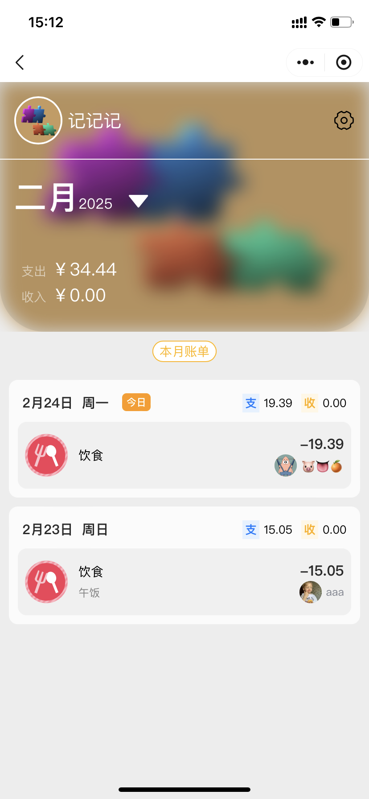
  
  
  
  

### Agent智能助手

在记账页点击自动记账就会跳转到AI自动记账页，用户只需输入或上传对应的账单图片，即可快速完成记账，系统会自动提取对应的类别。图片识别也采用OCR的方式，将账单文字提取出来后，交给AI帮我们完成记账操作。

  
  
  
  
  

  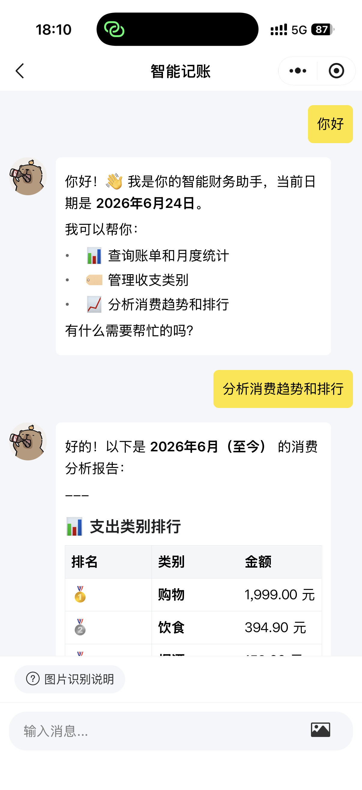

  

  
  
  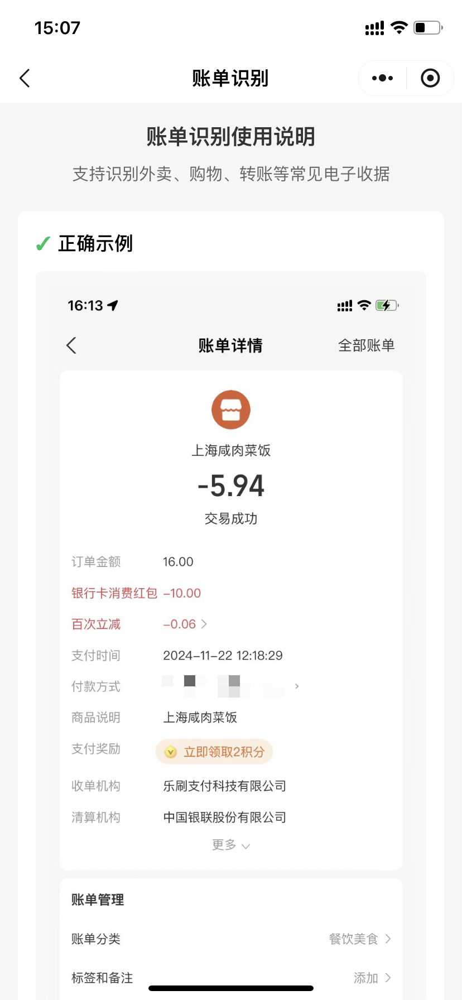

# 微信公众号

