# Agent智能记账小程序

> 作者：xiaozhu

Gitee：[https://github.com/tiancheng2002/pig-account](https://gitee.com/i-like-potato-chips/pig-account)

# 项目介绍

pig-acocunt 是一个基于 AI Agent 的微信记账小程序。用户可以用自然语言或账单图片完成记账，也可以在统一对话中查询真实账单、分析消费趋势、管理类别和维护个人记账偏好。

它并不是把所有工作都交给大模型：系统将自然语言理解与真实业务执行分开，由 Agent 负责识别意图、补全上下文和选择工具，由后端负责金额计算、类别校验、权限判断、数据查询与事务写入。模型无法直接生成 SQL，也不能自行指定用户身份。

例如：

```text
用户：周一早餐花了 7 块，午餐花了 19.8，晚餐花了 16
系统：识别为同一天的三笔餐饮支出，校验通过后一次性写入

用户：这个月花了多少？
系统：调用月度统计工具查询真实数据并生成回答

用户：上个月呢？
系统：结合当前会话的短期记忆理解连续追问

用户：以后打车默认记为交通，支付方式用微信
系统：识别为显式长期偏好，在受控规则下保存并用于后续记账
```

## 技术栈

| 层次       | 技术                                     | 职责                                           |
| ---------- | ---------------------------------------- | ---------------------------------------------- |
| 小程序端   | 微信小程序原生框架                       | 对话、账单、账本、分析与个人中心               |
| UI         | Vant Weapp、iView Weapp                  | 表单、弹窗和列表组件                           |
| 图表       | ECharts for Weixin                       | 类别占比、趋势与统计图表                       |
| 后端       | Java 8、Spring Boot 2.6.2                | REST API、业务编排、事务和权限                 |
| 持久化     | MyBatis / MyBatis-Plus、MySQL            | 用户、账本、账单、类别、预算与聊天数据         |
| 状态与缓存 | Redis                                    | 登录态、草稿、短期记忆、长期记忆缓存和确认令牌 |
| 文件存储   | MinIO                                    | 头像、账本图标和 OCR 图片                      |
| AI         | DeepSeek、OpenAI-compatible Tool Calling | 意图识别、账单提取、工具选择和回复生成         |
| OCR        | 独立 OCR 模块                            | 图片文字识别与账单文本提取                     |

## 功能列表

### 基础记账与账本能力

- 支持微信授权一键登录，全程不强制收集手机号，降低使用门槛并保护用户隐私。
- 支持按月查看收入、支出和账单明细，账单会按照日期分组展示，点击后可查看详情、编辑或删除。
- 支持日历视图展示每日收入和支出金额，点击具体日期可查看当天账单详情。
- 支持饼图展示指定月份的收入或支出类别占比，帮助用户快速了解消费结构。
- 支持账单排行功能，可按类别、月份、金额等维度查看收入或支出排行。
- 支持手动记账，用户可选择类别、输入金额、选择账本并快速完成账单记录。
- 支持自定义收入和支出类别，满足不同用户的个性化记账需求。
- 支持预算功能，用户可设置月度预算，更合理地规划支出。
- 支持多账本管理，用户可以创建不同类型的账本，单个用户最多可创建和加入 5 个账本。
- 支持账本协作，用户可以邀请好友加入公开账本，共同记录和管理账单。
- 支持账本成员管理，发起人可移除成员，成员也可自行退出，相关成员在该账本中的账单记录会同步处理。
- 支持自定义上传账本图标和用户头像，让账本和个人信息展示更加个性化。
- 支持生成动态小程序邀请码，方便邀请好友加入账本协作。

### AI Agent 智能记账能力

- **对话式自动记账**：用户只需输入自然语言，例如“今天中午吃饭花了 30 元”，Billing Agent 会自动提取金额、类别、时间、收支类型等关键信息，并完成账单记录。
- **多轮追问补全账单**：当用户输入的信息不完整时，例如只说“吃饭”，Agent 会主动追问缺失字段，并保存临时草稿；用户补充“30 元”后，系统会自动合并上下文并完成入账。
- **OCR 图片识别记账**：支持外卖订单、微信/支付宝账单、纸质小票、截图等图片场景，OCR 识别后的内容会继续进入 Billing Agent 流程完成智能记账。
- **本地 Fallback 容错能力**：当大模型调用异常或响应不稳定时，系统会通过本地规则识别金额、日期、常见类别和支付方式，提升记账链路的稳定性。
- **分类与权限校验**：AI 提取出的类别不会直接写入数据库，后端会校验该类别是否属于当前用户可用类别，并检查收支类型是否匹配，避免错误入账。
- **自然语言账单查询**：用户可以直接询问“这个月花了多少”“上个月呢”“餐饮支出是多少”，Tool Agent 会调用后端工具查询真实账单数据。
- **连续追问理解**：Agent 支持短期对话记忆，可以理解“上个月呢”“再按类别看看”等连续问题，不需要用户重复完整条件。
- **账单统计与趋势分析**：支持通过 Agent 查询月度收支汇总、类别支出排行、每日支出趋势和账单列表。
- **AI 账单分析**：系统可以结合真实账单数据生成消费总结、风险提示和理财建议，帮助用户更好地复盘消费习惯。
- **对话式类别创建**：用户可以通过聊天添加收入或支出类别，例如“添加一个文具支出类别”，Agent 会生成操作预览，并在用户确认后再写入数据。
- **写操作确认机制**：涉及新增类别等写操作时，系统不会直接执行，而是先返回确认提示，用户确认后才会真正写入，降低误操作风险。
- **工具调用安全控制**：Agent 只能调用后端已注册的白名单工具，不能生成 SQL，也不能自行指定用户身份，所有真实数据查询都由后端服务完成。

# Agent工作流程图

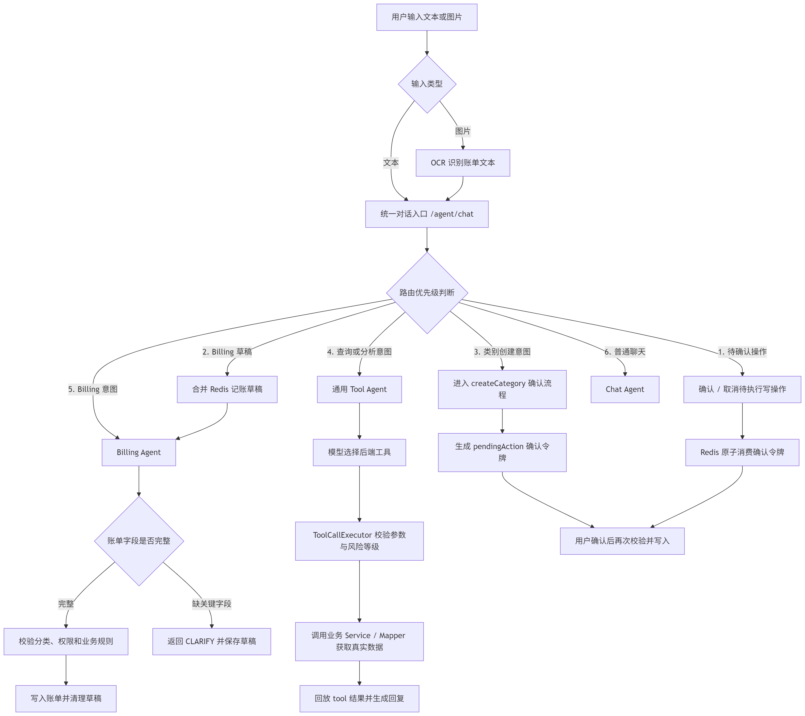

## 三层记忆工作流程图

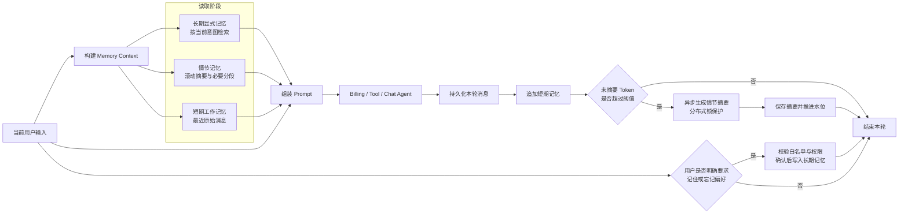
```mermaid
flowchart LR
    INPUT[当前用户输入]
    LOAD[构建 Memory Context]

    subgraph READ[读取阶段]
        L1[长期显式记忆<br/>按当前意图检索]
        L2[情节记忆<br/>滚动摘要与必要分段]
        L3[短期工作记忆<br/>最近原始消息]
    end

    PROMPT[组装 Prompt]
    AGENT[Billing / Tool / Chat Agent]
    SAVE[持久化本轮消息]
    APPEND[追加短期记忆]
    LIMIT{未摘要 Token<br/>是否超过阈值}
    SUMMARY[异步生成情节摘要<br/>分布式锁保护]
    WATERMARK[保存摘要并推进水位]
    EXPLICIT{用户是否明确要求<br/>记住或忘记偏好}
    MEMORY_WRITE[校验白名单与权限<br/>确认后写入长期记忆]

    INPUT --> LOAD
    LOAD --> L1
    LOAD --> L2
    LOAD --> L3
    L1 --> PROMPT
    L2 --> PROMPT
    L3 --> PROMPT
    INPUT --> PROMPT
    PROMPT --> AGENT --> SAVE --> APPEND --> LIMIT
    LIMIT -->|是| SUMMARY --> WATERMARK
    LIMIT -->|否| DONE[结束本轮]
    WATERMARK --> DONE
    INPUT --> EXPLICIT
    EXPLICIT -->|是| MEMORY_WRITE --> DONE
    EXPLICIT -->|否| DONE
```

## 核心亮点

### 1. 多笔对话式记账

- 从一句自然语言中提取一笔或多笔账单。
- 支持金额、收支类型、类别、日期、备注和支付方式。
- 支持带单位金额及明确记账语境中的无单位金额。
- 统一按 `Asia/Shanghai` 解释“今天”“昨天”“上周一”等相对日期。
- 多笔账单必须全部校验通过后一次性写入，避免部分成功。

### 2. 多轮追问与 Billing 草稿

当金额、类别等关键字段缺失时，Agent 返回 `CLARIFY` 并将未完成账单保存到 Redis。用户下一轮只需补充缺失信息，系统会继续完成原来的记账任务。

草稿按 `userId + conversationId` 隔离，成功、取消或超时后自动清理；新版草稿支持多账单，同时兼容旧的单账单 JSON。

### 3. 可插拔 Tool Calling

所有业务工具统一实现 `AgentTool`：

```java
public interface AgentTool {
    ToolDefinition definition();

    ToolExecutionResult execute(
            ToolExecutionContext context,
            JSONObject arguments
    );
}
```

每个工具独立声明名称、说明、严格 JSON Schema、风险等级和前端展示类型。Spring 会自动发现工具 Bean，新增工具不需要修改集中注册表或主编排器。

当前工具包括：

| 工具                          | 风险等级        | 功能                 |
| ----------------------------- | --------------- | -------------------- |
| `queryBillList`               | `READ_ONLY`     | 查询指定月份账单     |
| `queryMonthlyBillStatistics`  | `READ_ONLY`     | 查询收入、支出和结余 |
| `queryCategoryExpenseRanking` | `READ_ONLY`     | 查询类别支出排行     |
| `queryDailyExpenseTrend`      | `READ_ONLY`     | 查询每日支出趋势     |
| `listCategories`              | `READ_ONLY`     | 查询当前用户可用类别 |
| `createCategory`              | `WRITE_CONFIRM` | 创建收入或支出类别   |
| `rememberUserPreference`      | `WRITE_CONFIRM` | 保存长期偏好候选     |
| `forgetUserPreference`        | `WRITE_CONFIRM` | 删除单条长期偏好     |
| `clearUserPreferences`        | `WRITE_CONFIRM` | 清空长期偏好         |

### 4. 三层记忆

系统没有把整段聊天历史无限发送给模型，而是根据内容生命周期拆分为三层记忆：

| 记忆层       | 作用域     | 主要内容                                             | 存储与恢复                       |
| ------------ | ---------- | ---------------------------------------------------- | -------------------------------- |
| 短期工作记忆 | 当前会话   | 最近几轮原始文本和当前任务上下文                     | Redis 缓存，必要时从聊天记录恢复 |
| 情节记忆     | 当前会话   | 较早对话的分段摘要、滚动摘要和未完成事项             | MySQL 持久化，异步生成           |
| 长期显式记忆 | 用户或账本 | 默认支付方式、类别映射、回复风格、分析维度和默认账本 | MySQL 为事实来源，Redis 缓存     |

长期记忆只保存用户明确表达且在白名单范围内的偏好，不保存模型推测的敏感画像，也不能代替账单、预算和类别等真实业务数据。

### 5. 可控写操作

Agent 工具分为三种风险等级：

- `READ_ONLY`：参数和权限校验后可自动执行。
- `WRITE_CONFIRM`：先返回操作预览和一次性确认令牌，用户确认后再写入。
- `FORBIDDEN`：不向模型暴露并拒绝执行。

确认令牌绑定当前用户和对话，并通过 Redis 原子读取并删除，避免重复确认导致重复写入。确认执行时仍会重新检查权限和业务规则。

### 6. 真实数据与模型生成分离

- 金额汇总、账单列表、类别排行和每日趋势由后端查询与计算。
- AI 负责理解问题、选择工具和生成自然语言总结。
- 图表数据不由模型编造。
- 模型返回的账单必须经过字段、类别、类型和权限校验。
- DeepSeek 不可用时，基础记账仍可通过本地规则降级处理。

### 7. 可追踪与安全日志

Agent 和 OCR Billing 请求会生成或复用 `X-Trace-Id`，并通过 MDC 串联入口、路由、Memory、缓存、模型、校验、工具和落库日志。

- INFO 记录状态、数量、耗时和稳定错误原因。
- DEBUG 内容日志由配置开关控制，并进行脱敏与截断。
- 手机号、身份证、银行卡和令牌等敏感内容不会原样输出。
- 生产环境默认关闭模型输入输出正文日志。

# 小程序页面

### 智能记账

<div style="display:flex">
  
  
  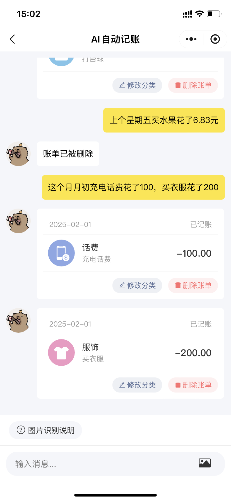

  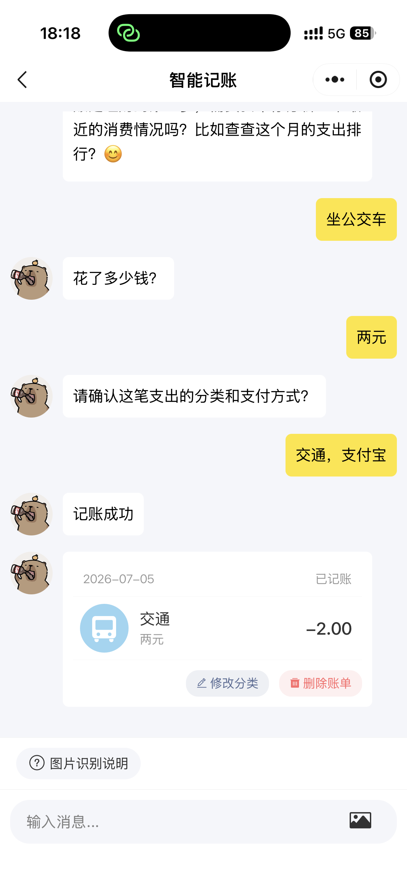

  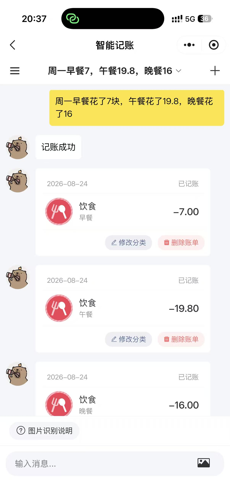
</div>

### OCR图片识别记账

<div style="display:flex">
  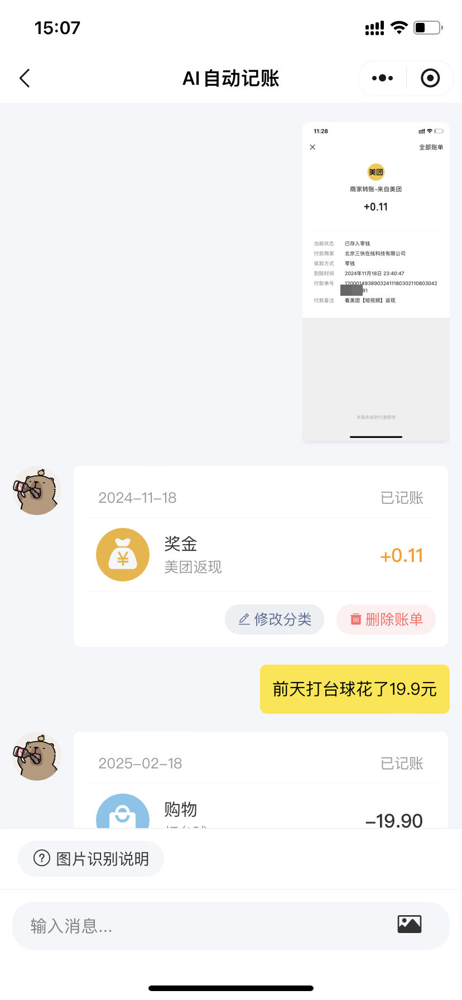
  
  
</div>

### 新增类别

<div style="display:flex">
  

  
</div>

### 账单分析查看

<div style="display:flex">
  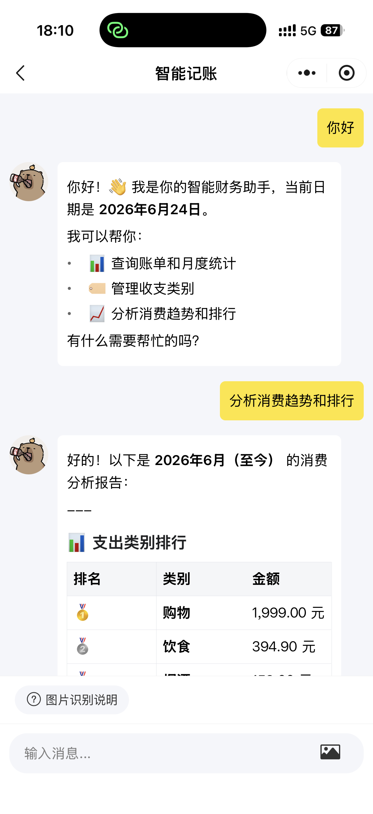

  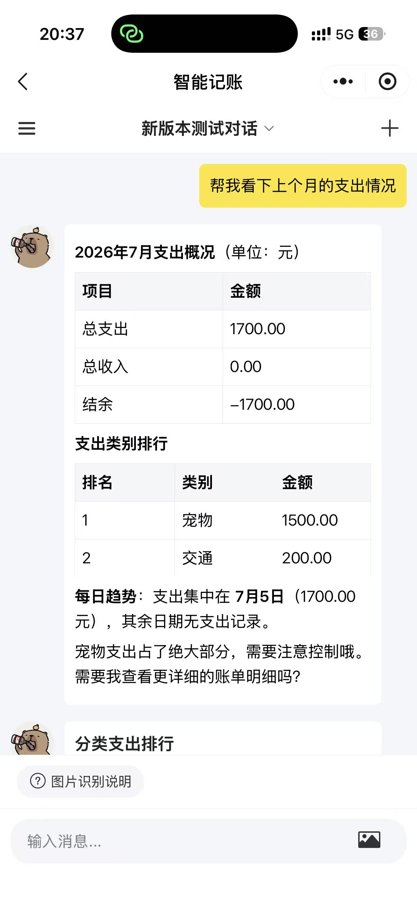

  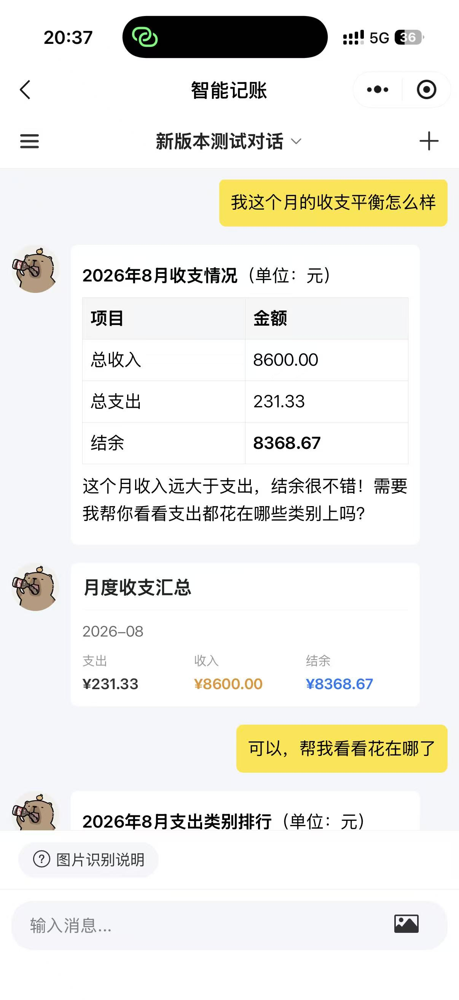
</div>

### Agent记忆

<div style="display:flex">
  

  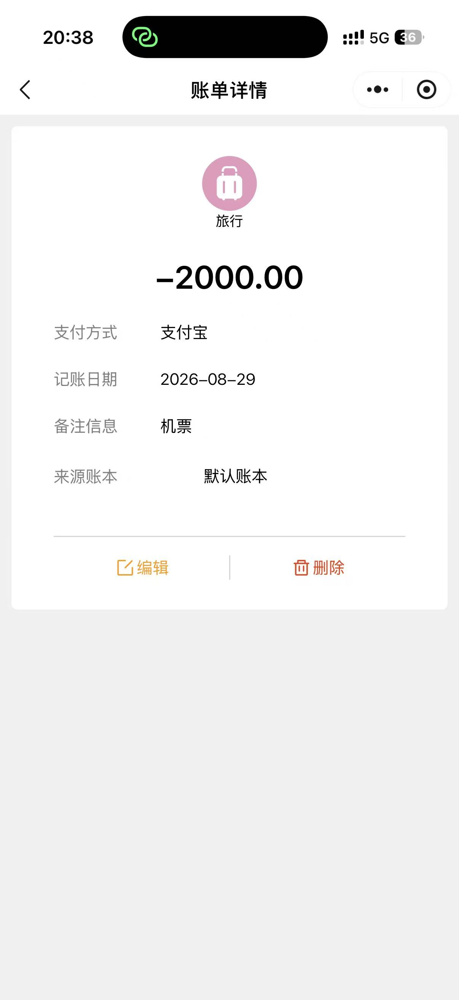

  
</div>

### 首页

在首页可以查看到某个月的所有支出与收入情况，并且会根据日期对每一天的支出与收入进行划分，在顶部可以点击对应的年月进行切换，右侧还可以查看指定账本中的账单数据

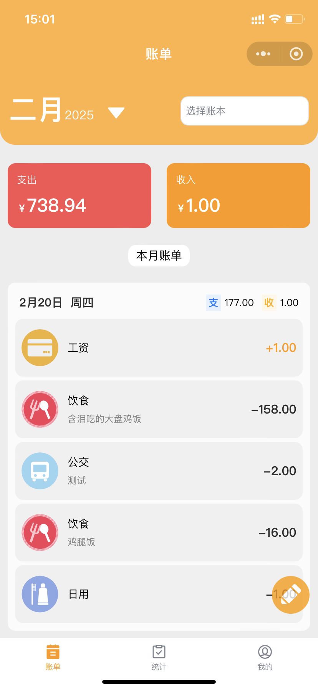

点击对应的账单数据就能查看到对应的详情，也可以对账单进行编辑，也可以将他删除

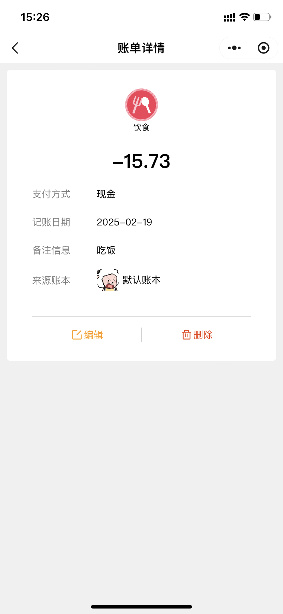

### 日历表展示

在统计页的最上方会有一个日历表，会显示某个月的每一天的支出或收入金额，并且各自的颜色深度会随着金额的大小而变化，点击对应的日期还能查看到某一天的支出或收入情况

<div style="display:flex">
  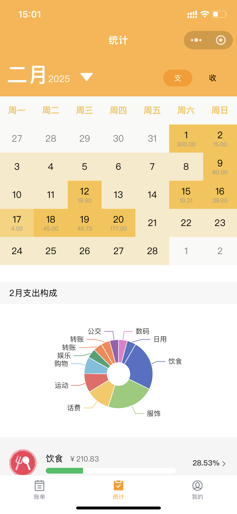

  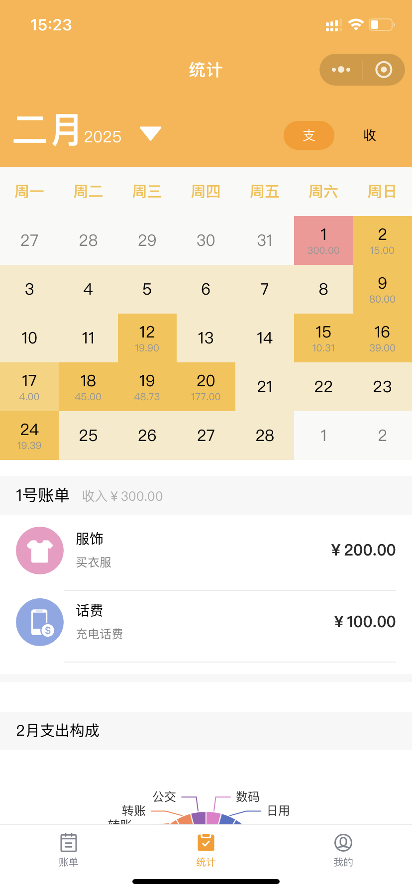
</div>

### 统计图展示

在日历表的下方会有一个饼状统计图，主要是展示某个月支出或收入的占比，让用户可以清晰的感知自己在不同类别的消费或收入情况，点击下方对应类别会调转到账单排行页，里面可以查看某一类别的账单数据排行

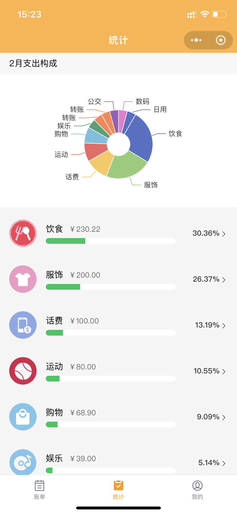

### 账单排行

在饼图的下方会有一栏账单排行的数据列表，会按照金额大小从高到低展示某月支出或收入的账单数据，如果数据超过十条的话，可以点击最下方的`全部排行`跳转到账单排行页进行查看，在里面可以按照金额或时间进行排序

<div style="display:flex">
  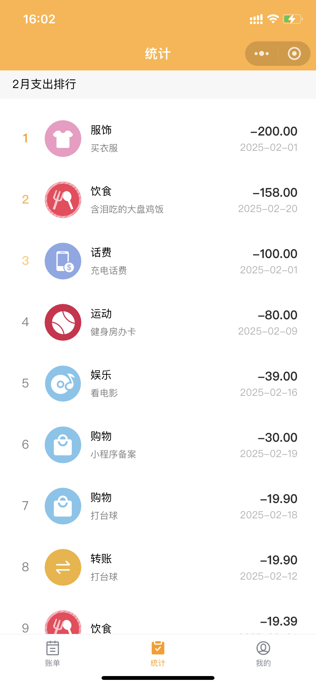

  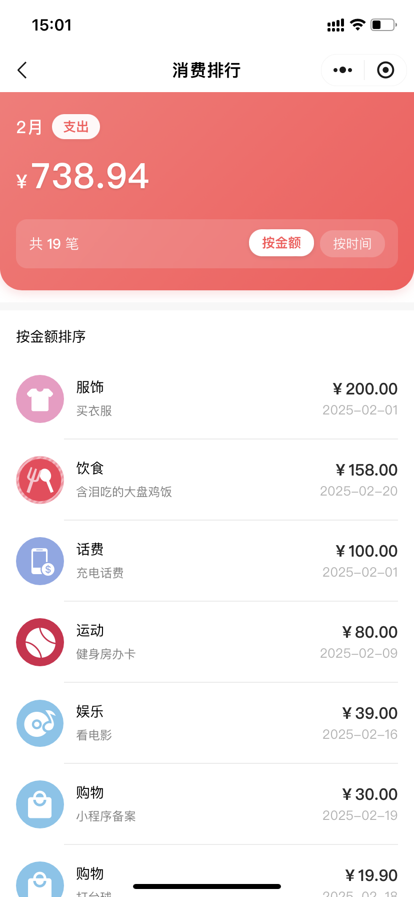

  
</div>


### 个人中心

在个人中心页面，用户可以看到自己的记账天数以及记账笔数，还可以看到自己的剩余预算信息。点击头像名称或预算就会跳转到编辑页，在里面可以更改自己的头像、昵称以及预算信息

<div style="display:flex">
  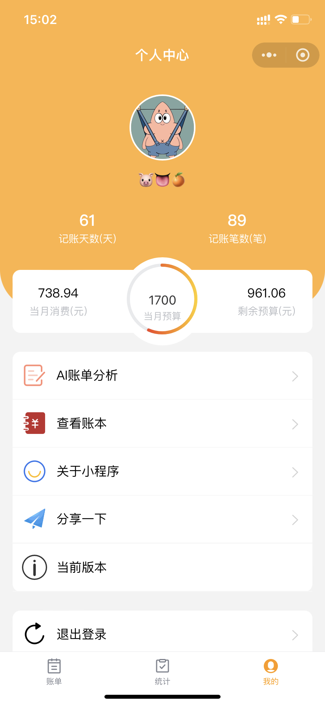
  
  
  
  
</div>

### 记账功能

在记账页中，用户可以自主的选择对应的类别、支付方式、要记录的账本以及输入金额和备注等信息，然后点击记账按钮就可以轻松的完成一笔记账啦

<div style="display:flex">
  
  
  
</div>

### 自定义类别

在自定义类别页，用户可以自定义自己的类别内容，目前暂不支持自定义类别图标，只能添加对应的文字。可以有选择性的定义不同的支出或收入类别

<div style="display:flex">
  
  
  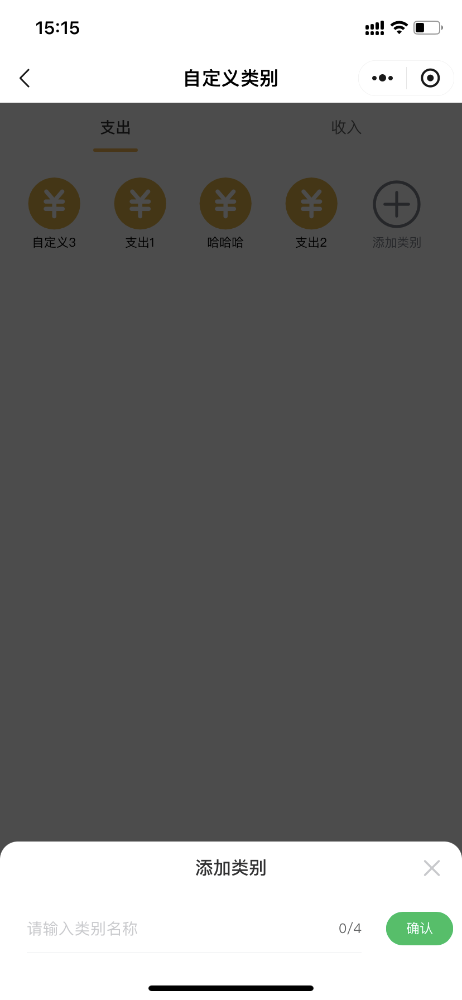
</div>

### 自定义账本

在我的账本页中用户可以看到自己创建和加入的账本信息，如果是公开账本的话，就会显示对应账本的加入人数和最大人数，点击下方的添加按钮会跳转到账本添加页

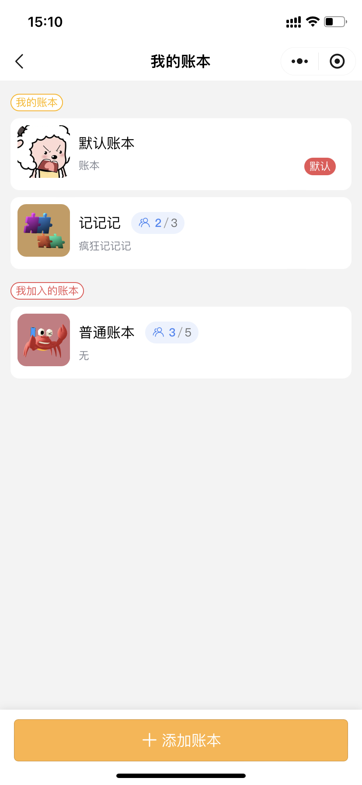

在账本添加页中，可以对添加账本也可以对账本信息进行编辑，用户可以选择系统的图标也可以自定义上传图标


### 账本账单页

在该页面中会显示该账本的所有账单信息，如果是公开账本的话，在每一条账单记录下都会有对应记账人的头像和昵称。点击右上角的设置会显示菜单栏，目前菜单栏只有查看成员、邀请成员、编辑账本、解散账本这四个选项。

<div style="display:flex">
  
  
  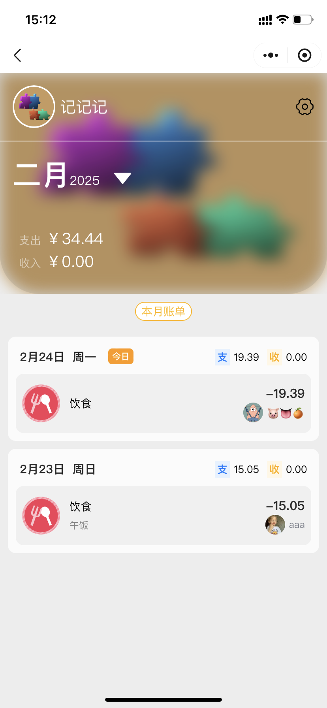
  
  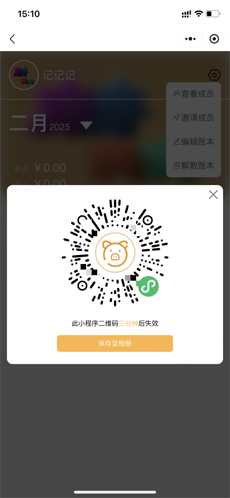
  
  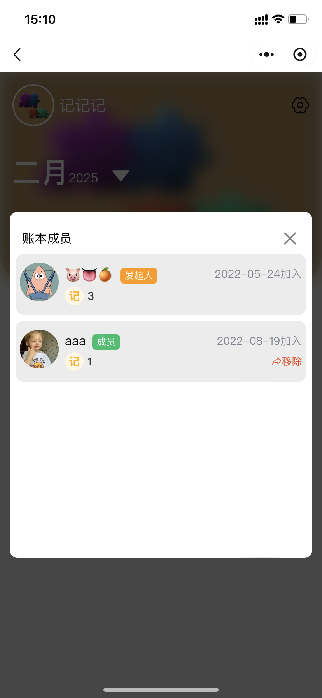
</div>

# 微信公众号


