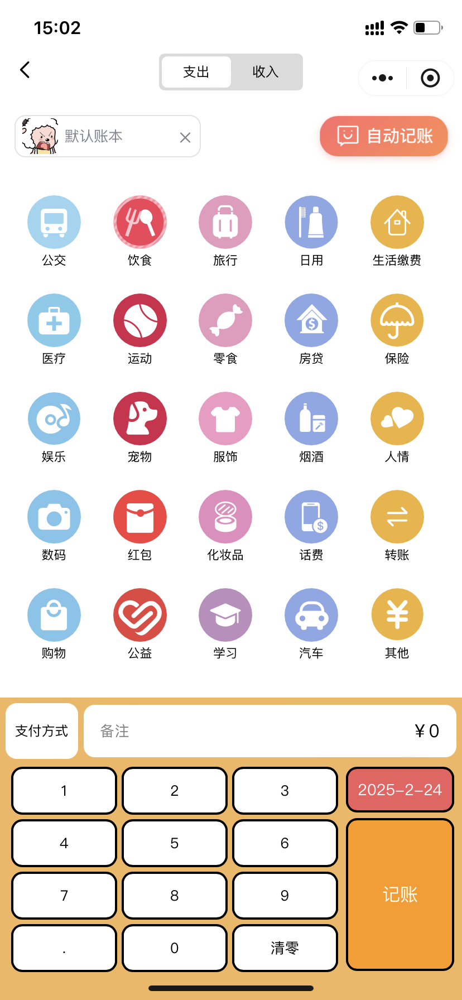

# AI记账小程序

> 作者：xiaozhu

Gitee：[https://github.com/tiancheng2002/pig-account](https://gitee.com/i-like-potato-chips/pig-account)

# 项目介绍

一个AI对话自动记账小程序，能够根据你输入的文字或上传的账单图片自动识别出对应的账单数据，比如 “今天中午吃饭花了30元”，AI 便能迅速捕捉到关键信息，精准识别消费金额、类别以及时间等数据，并自动完成记账操作。

界面设计简洁直观，没有复杂繁琐的操作流程，即使是初次使用的用户，也能在短时间内轻松上手。同时，小程序还有账本功能，用户可以创建不同的账单来记录自己的账单，还可以邀请朋友加入到账本中进行协作。

并且还有一些日历表以及饼图这些图形化的组件，让你能够更清晰的了解到自己的支出或收入情况，能够更好的规划管理自己的财务。

## 技术栈

前端：微信小程序

UI组件：Vant、IView

统计图：ECharts

后端：SpringBoot、Mybatis、Redis、MySQL、Minio等

## 功能列表

### 老版本功能

- 支持微信授权一键登录，全程不强制收集手机号，保障用户隐私

- 首页查看某月支出收入账单列表，按照日期进行划分显示，点击账单可查看对应账单详情，可编辑可删除
- 通过日历表形式展示某月对应日期的支出或收入金额，点击某一日期可查看详情
- 用饼图展示某月支出或收入对应的类别占比，快速了解自己大致消费或收入方向
- 账单排行功能，可按照类别或月份等按照时间或金额查看排行列表
- 记账功能，用户选择类别、输入金额、选择合适账本等即可快速完成记账
- 自定义类别功能，支持自定义支出或收入类别内容
- 预算功能，可自定义设置预算，能够更合理规划自己的支出情况
- 账本功能，可自定义添加不同类型的账本，单个用户最大可创建和加入五个账本
- 邀请好友加入账本功能，创建一个类型为公开的账本，用户就能邀请自己的好友加入账本进行共同协作
- 账本的发起人可移除账本内的成员，成员也可以自行退出，对应的账单记录也会被删除

### 新版本新增功能

- 添加账本时可自定义上传账本图标
- 支持用户自定义上传个人喜欢的图片作为头像
- 生成动态小程序邀请码邀请朋友加入账本协作
-  **AI 聊天式记账功能**，用户只需与 AI 交互，即可快速完成记账，并即时返回记账成功的账单数据
- **OCR图片识别记账功能**，适用于外卖、微信/支付宝账单、纸质小票、截图等场景
- **AI账单分析功能**，通过对某月账单数据的深度分析，为用户提供专业的消费建议，助力用户优化财务管理（Beta）

## 演示环境

**老版本演示环境：**

**新版目前还未上线**

# 新版本功能演示

### 首页

在首页可以查看到某个月的所有支出与收入情况，并且会根据日期对每一天的支出与收入进行划分，在顶部可以点击对应的年月进行切换，右侧还可以查看指定账本中的账单数据

点击对应的账单数据就能查看到对应的详情，也可以对账单进行编辑，也可以将他删除

### 日历表展示

在统计页的最上方会有一个日历表，会显示某个月的每一天的支出或收入金额，并且各自的颜色深度会随着金额的大小而变化，点击对应的日期还能查看到某一天的支出或收入情况

  

  

### 统计图展示

在日历表的下方会有一个饼状统计图，主要是展示某个月支出或收入的占比，让用户可以清晰的感知自己在不同类别的消费或收入情况，点击下方对应类别会调转到账单排行页，里面可以查看某一类别的账单数据排行

### 账单排行

在饼图的下方会有一栏账单排行的数据列表，会按照金额大小从高到低展示某月支出或收入的账单数据，如果数据超过十条的话，可以点击最下方的`全部排行`跳转到账单排行页进行查看，在里面可以按照金额或时间进行排序

### 个人中心

在个人中心页面，用户可以看到自己的记账天数以及记账笔数，还可以看到自己的剩余预算信息。点击头像名称或预算就会跳转到编辑页，在里面可以更改自己的头像、昵称以及预算信息

### 记账功能

在记账页中，用户可以自主的选择对应的类别、支付方式、要记录的账本以及输入金额和备注等信息，然后点击记账按钮就可以轻松的完成一笔记账啦

### 自定义类别

在自定义类别页，用户可以自定义自己的类别内容，目前暂不支持自定义类别图标，只能添加对应的文字。可以有选择性的定义不同的支出或收入类别

### 自定义账本

在我的账本页中用户可以看到自己创建和加入的账本信息，如果是公开账本的话，就会显示对应账本的加入人数和最大人数，点击下方的添加按钮会跳转到账本添加页

在账本添加页中，可以对添加账本也可以对账本信息进行编辑，用户可以选择系统的图标也可以自定义上传图标

### 账本账单页

在该页面中会显示该账本的所有账单信息，如果是公开账本的话，在每一条账单记录下都会有对应记账人的头像和昵称。点击右上角的设置会显示菜单栏，目前菜单栏只有查看成员、邀请成员、编辑账本、解散账本这四个选项。

### AI聊天记账

在记账页点击自动记账就会跳转到AI自动记账页，用户只需输入或上传对应的账单图片，即可快速完成记账，系统会自动提取对应的类别。图片识别也采用OCR的方式，将账单文字提取出来后，交给AI帮我们完成记账操作。

# 源码说明

适用于毕业设计、个人学习及自主二次开发

需要本地部署或源码的+V：ACheng-0202

# 微信公众号

